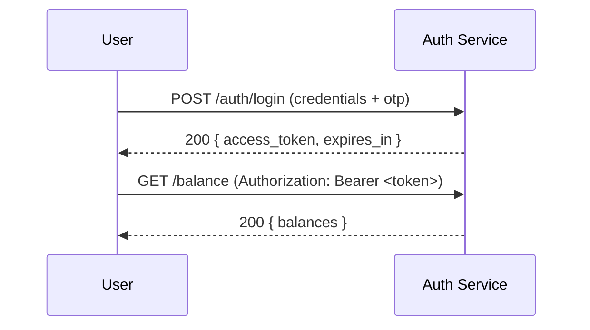
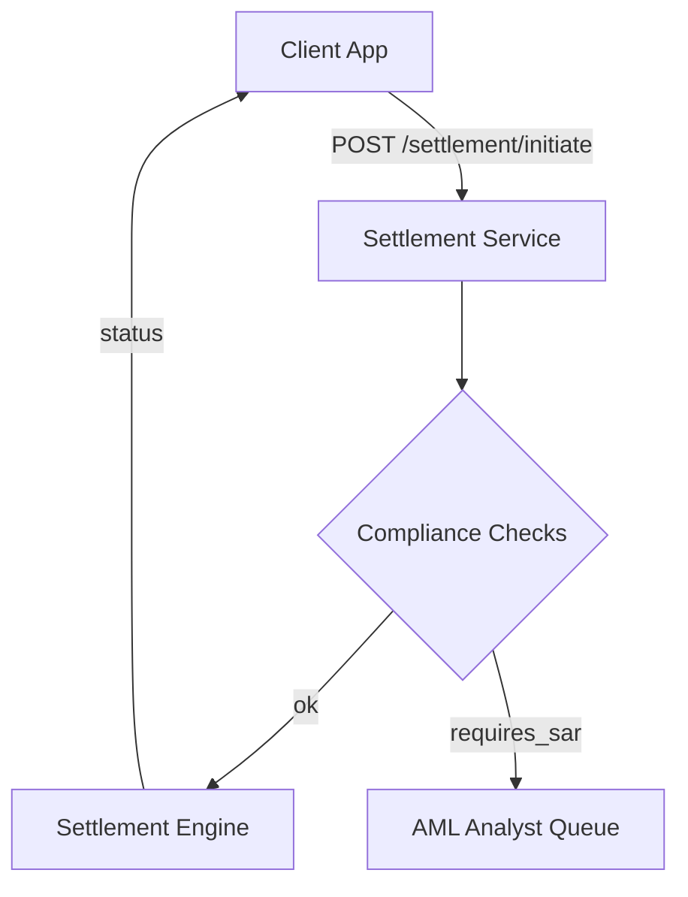

# API Guide — TEOS BankChain Mobile

⚠️ **Private Repository — Restricted to Partner Banks Only**  
Access is limited to financial institutions operating under direct agreement with TEOS Egypt.  
Redistribution or public disclosure is prohibited.

---

## 📌 Overview
This guide documents the **FastAPI backend endpoints**, **mobile client flows**, **compliance mapping**, and developer artifacts (OpenAPI, Postman collection, ISO 20022 examples).  
All requests must be authenticated and comply with TEOS Egypt’s compliance framework (KYC/AML, audit trails, regulator reporting).

---

## 🔑 Authentication
**Endpoint:** `POST /auth/login`

**Request**
```json
{
  "username": "bankuser1",
  "password": "securePassword123",
  "otp": "123456"
}
```

**Response**
```json
{
  "access_token": "eyJhbGciOiJIUzI1NiIs...",
  "token_type": "bearer",
  "expires_in": 3600
}
```

---

## 🏦 Accounts
**Endpoint:** `POST /accounts/create`

**Request**
```json
{
  "customer_id": "CUST12345",
  "fiat_currency": "EGP",
  "crypto_currency": "USDT"
}
```

**Response**
```json
{
  "account_id": "ACC98765",
  "status": "active",
  "created_at": "2025-11-30T21:30:00Z"
}
```

---

## 💱 Conversion
**Endpoint:** `POST /convert/execute`

**Request**
```json
{
  "account_id": "ACC98765",
  "from_currency": "EGP",
  "to_currency": "USDT",
  "amount": 1000.00
}
```

**Response**
```json
{
  "transaction_id": "TX123456",
  "status": "completed",
  "converted_amount": 19.50,
  "rate": 51.28,
  "timestamp": "2025-11-30T21:32:00Z"
}
```

---

## 📊 Balance
**Endpoint:** `GET /balance?account_id=ACC98765`

**Response**
```json
{
  "account_id": "ACC98765",
  "balances": {
    "EGP": 5000.00,
    "USDT": 250.00
  },
  "last_updated": "2025-11-30T21:35:00Z"
}
```

---

## 📜 Transactions
**Endpoint:** `POST /transactions`

**Request**
```json
{
  "account_id": "ACC98765",
  "type": "transfer",
  "to_account": "ACC54321",
  "amount": 100.00,
  "currency": "USDT"
}
```

**Response**
```json
{
  "transaction_id": "TX654321",
  "status": "pending",
  "audit_log_id": "AUD12345",
  "timestamp": "2025-11-30T21:36:00Z"
}
```

---

## 📈 Rates
**Endpoint:** `GET /rates?from=EGP&to=USDT`

**Response**
```json
{
  "from_currency": "EGP",
  "to_currency": "USDT",
  "rate": 51.28,
  "timestamp": "2025-11-30T21:37:00Z"
}
```

---

## 📱 Mobile Client Flows
- **Login Screen** → Calls `/auth/login` with OTP + biometrics  
- **Dashboard Screen** → Fetches `/balance` and `/transactions`  
- **Transfer Screen** → Executes `/transactions` with QR‑based account IDs  
- **Conversion Screen** → Calls `/convert/execute`  
- **Compliance Alerts** → Push notifications triggered by backend monitoring  

---

## 🔒 Compliance Layer
- All endpoints log immutable audit trails  
- KYC/AML enforced at account creation and transaction execution  
- Regulator reporting stubs available for **CBE, SAMA, FCA, FATF**  

---

## 📎 Developer Artifacts

### 🔁 Diagrams (Mermaid)
**Authentication Flow**


**Settlement Flow**


---

### 🧾 OpenAPI (YAML)
Full OpenAPI spec included for Swagger/Redoc import.  
Save as `openapi.yaml` and import into your API docs system. *(see attached block in repo)*

---

### 🧾 Postman Collection (v2.1 JSON)
Save as `TEOS_BankChain_Postman_Collection.json` and import into Postman.  
Includes **Auth, Accounts, Compliance (KYC, SAR, Export)** endpoints. *(see attached block in repo)*

---

### 🏦 ISO 20022 / XML Example
Sample `pacs.008` (Customer Credit Transfer) included for settlement reporting.  
Save as `pacs.008.sample.xml` for regulator testing. *(see attached block in repo)*

---

## 📦 Delivery & Files
- **OpenAPI YAML** → `openapi.yaml`  
- **Postman JSON** → `TEOS_BankChain_Postman_Collection.json`  
- **ISO 20022 XML** → `pacs.008.sample.xml`  

---

## 📞 Contact
**TEOS Egypt Technical Team**  
📧 Private partner channel  
📱 WhatsApp: +20 100 616 7293  
🔗 [LinkedIn: Ayman Seif](https://www.linkedin.com/in/aymanseif/)

---

## 🔁 Change Log
- `2025-11-30` — Full API guide + OpenAPI YAML + Postman collection + ISO 20022 examples added
