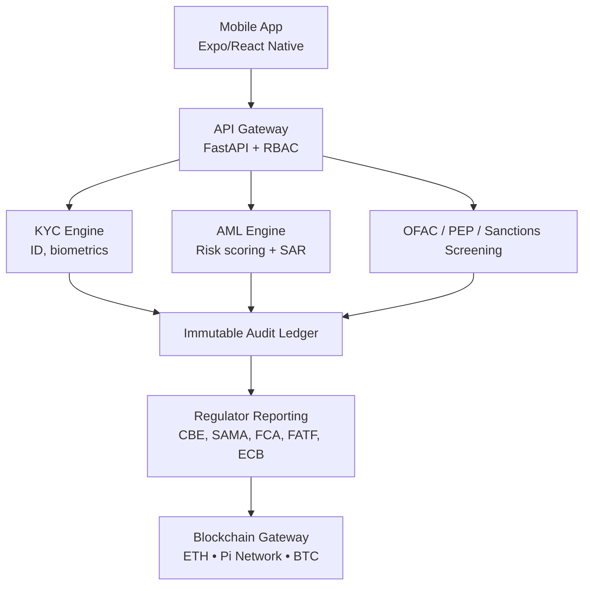

# TEOS BankChain Mobile 🚀 — Enterprise Digital Asset Infrastructure for Partner Banks

“Part of the TEOS Egypt Blockchain Ecosystem — a unified civil, financial, and smart‑city infrastructure powering digital banking, civic governance, DeFi, Pi integration, and national blockchain services.”

---

## 🛑 PROPRIETARY & CONFIDENTIAL — TEOS EGYPT
[](https://github.com/Elmahrosa/Teos-Pharaoh-Portal/blob/main/TESL.md)

> Copyright © 2025 Elmahrosa International.  
> All Rights Reserved.  
> This material is NOT open source and is protected by the TEOS Egypt Sovereign License (TESL).  
> For the full license text, see [TEOS Egypt Sovereign License (TESL)](https://github.com/Elmahrosa/Teos-Pharaoh-Portal/blob/main/TESL.md).  
>  
> **Initial Author:** Elmahrosa International  
> **Governing law and venue:** Cairo, Arab Republic of Egypt.

---


---

📊 Sample regulator reports available in [compliance/samples](./compliance/samples)

## 📑 Compliance & Playbooks
- 🇪🇬 [CBE Playbook](./compliance/CBE_PLAYBOOK.md)  
- 🇸🇦 [SAMA Playbook](./compliance/SAMA_PLAYBOOK.md)  
- 🌍 [Global Playbook](./compliance/GLOBAL_PLAYBOOK.md)  
- 📊 [Sample Regulator Reports](./compliance/samples)  
- 📑 [Compliance Index](./COMPLIANCE_INDEX.md)

---

## 🌍 Overview

**TEOS BankChain Mobile** is an enterprise‑grade, regulator‑aligned blockchain infrastructure for **licensed financial institutions only**.  

## Security & Hardening
- CI/CD pipelines: [ci.yml](./.github/workflows/ci.yml), CodeQL, Dependabot  
- Static analysis: Bandit (Python), ESLint (JS)  
- Container security: Trivy scans  
- Commit signing & branch protection enforced  
- Incident response: [INCIDENT_RESPONSE.md](./docs/INCIDENT_RESPONSE.md)  
- Continuity planning: [BUSINESS_CONTINUITY_PLAN.md](./docs/BUSINESS_CONTINUITY_PLAN.md)  
- Communication plan: [COMMUNICATION_PLAN.md](./docs/COMMUNICATION_PLAN.md)

**Features:**
- Secure custodial wallets  
- Fiat ↔ cryptocurrency conversion  
- Automated KYC/AML/SAR compliance  
- Regulator‑ready audit trails  
- Full integration with bank core systems  

Deployment models: **on‑prem**, **air‑gapped**, or **cloud**.

---

## 🏛 Constitution Alignment (Global Governance Backbone)

Anchored to the 📘 **International Civic Blockchain Constitution**:  
https://github.com/Elmahrosa/International-Civic-Blockchain-Constitution

**Modules enforced:**
- Governance – proposal/ratification  
- Treasury – liquidity, contribution handling  
- Compliance – KYC, AML, SAR  
- Audit – internal + regulator  
- Risk – SIEM, incident response, resilience  

---

## 🛡 Global Regulator & Central Bank Compliance

Aligned with:
- CBE – Central Bank of Egypt  
- SAMA – Saudi Central Bank  
- FCA – UK Financial Conduct Authority  
- FINMA – Swiss Financial Market Authority  
- MAS – Monetary Authority of Singapore  
- ECB – European Central Bank  
- FRB – U.S. Federal Reserve Board  
- OFAC – U.S. Treasury Sanctions Office  
- FATF – Global AML/CFT Standards  
- UNODC – Anti‑Money Laundering Framework  
- IMF – International Financial Stability Guidelines  
- BIS – Bank for International Settlements Standards  

---

## 🏗 Compliance Architecture Diagram (ASCII)

```
            ┌──────────────────────────┐
            │     Mobile App (MDM)     │
            │  Staff & Customer Portal │
            └─────────────┬────────────┘
                          │
                          ▼
              ┌─────────────────────┐
              │   API Gateway       │
              │ (FastAPI + RBAC)    │
              └──────────┬───────────┘
                         │
┌────────────────────────┼────────────────────────┐
▼                        ▼                        ▼
┌──────────────┐       ┌───────────────────┐     ┌──────────────────┐
│  KYC Engine  │       │   AML Engine      │     │Sanctions/PEP/OFAC│
│ (ID, Biom.)  │       │ Scoring + SAR     │     │ screening modules │
└──────────────┘       └───────────────────┘     └──────────────────┘
│                         │                        │
└──────────────┬──────────┴───────────┬────────────┘
▼                      ▼
┌─────────────────┐     ┌───────────────────┐
│ Audit Ledger     │     │ Regulator Reports │
│ (Immutable Logs) │     │ (CBE, SAMA, FCA…) │
└─────────────────┘     └───────────────────┘
│
▼
┌─────────────────────┐
│ Blockchain Gateway  │
│ (ETH / Pi / BTC)    │
└─────────────────────┘
```

---

## 🧭 Mermaid Version



---

## 🛠 Tech Stack

| Category    | Technologies                                  |
| ----------- | --------------------------------------------- |
| **Backend** | FastAPI, Uvicorn, Python 3.11                 |
| **Mobile**  | React Native, Expo, TypeScript                |
| **CI/CD**   | GitHub Actions, Dependabot, CodeQL            |
| **Future**  | ETH / Pi / BTC connectors, compliance tooling |

---

## 🚀 Feature Highlights

- ISO 27001 & SOC2 aligned  
- AML/CFT automation  
- Regulator‑native reporting  
- Immutable audit logs  
- Enterprise CI/CD with CodeQL & Dependabot  
- Air‑gap deployment compatible  

---

## 🔒 Repository Hardening Dashboard

*(Self‑audit of governance, compliance, and security readiness)*

| Category                            | Status |
| ----------------------------------- | ------ |
| Repository Governance               | ✅ Done |
| Code of Conduct                     | ✅ Done |
| Contributing Guidelines             | ✅ Done |
| Code Owners / Branch Protection     | ✅ Done |
| Commit Signing / Traceability       | ✅ Done |
| Access Management                   | ✅ Done |
| Security & Compliance               | ✅ Done |
| Secret Management                   | ✅ Done |
| Secret Scanning                     | ✅ Done |
| Dependency Management               | ✅ Done |
| Static Analysis / SAST              | ✅ Done |
| Penetration Testing                 | ✅ Done |
| Versioning & Release                | ✅ Done |
| Changelog                           | ✅ Done |
| Release Tags                        | ✅ Done |
| Deployment Notes                    | ✅ Done |
| Testing & CI/CD                     | ✅ Done |
| Unit Tests                          | ✅ Done |
| Integration Tests                   | ✅ Done |

---
---

## 📜 License & NDA — Private Restricted Access

**Private © Elmahrosa & TEOS Egypt**  
Effective: **Nov 30, 2025**

- Strict NDA covering code, architecture, and compliance badges  
- No redistribution, screenshots, or public disclosure  
- Violations → Legal enforcement under Egyptian law  

---

# 📞 Executive Contact

**Founder & CEO: Ayman Seif**

📧 [ayman@teosegypt.com](mailto:ayman@teosegypt.com)  
📱 WhatsApp: +20 100 616 7293  
🔗 [LinkedIn](https://www.linkedin.com/in/aymanseif/)  
🌐 [https://bankchain.teosegypt.com](https://bankchain.teosegypt.com)

---

## ✍️ Author Signature

  
  


**Signed:**  
Ayman Seif — Founder & CEO, TEOS Egypt / Elmahrosa International

