# TEOS BankChain Mobile 🚀 — Enterprise Digital Asset Infrastructure for Partner Banks

“Part of the TEOS Egypt Blockchain Ecosystem — a unified civil, financial, and smart-city infrastructure powering digital banking, civic governance, DeFi, Pi integration, and national blockchain services.”

---

## 🛑 PROPRIETARY & CONFIDENTIAL — TEOS EGYPT
[](https://github.com/Elmahrosa/Teos-Pharaoh-Portal/blob/main/TESL.md)

> Copyright © 2025 Elmahrosa International. All Rights Reserved.  
> This material is NOT open source and is protected by the TEOS Egypt Sovereign License (TESL).  
> For the full license text, see [TEOS Egypt Sovereign License (TESL)](https://github.com/Elmahrosa/Teos-Pharaoh-Portal/blob/main/TESL.md).
> 
> **Initial Author:** Elmahrosa International  
> **Governing law and venue:** Cairo, Arab Republic of Egypt.
---


---

## 🌍 Overview

**TEOS BankChain Mobile** is an enterprise-grade, regulator-aligned blockchain infrastructure for **licensed financial institutions only**.  

Features:
- Secure custodial wallets  
- Fiat ↔ cryptocurrency conversion  
- Automated KYC/AML/SAR compliance  
- Regulator-ready audit trails  
- Full integration with bank core systems  

Deployment models: **on-prem**, **air-gapped**, or **cloud**.

---

## 🏛 Constitution Alignment (Global Governance Backbone)

Anchored to the 📘 **International Civic Blockchain Constitution**:  
https://github.com/Elmahrosa/International-Civic-Blockchain-Constitution

Modules enforced:
- **Governance** – proposal/ratification  
- **Treasury** – liquidity, contribution handling  
- **Compliance** – KYC, AML, SAR  
- **Audit** – internal + regulator  
- **Risk** – SIEM, incident response, resilience  

---

## 🛡 Global Regulator & Central Bank Compliance

Aligned with:
- **CBE – Central Bank of Egypt**  
- **SAMA – Saudi Central Bank**  
- **FCA – UK Financial Conduct Authority**  
- **FINMA – Swiss Financial Market Authority**  
- **MAS – Monetary Authority of Singapore**  
- **ECB – European Central Bank**  
- **FRB – U.S. Federal Reserve Board**  
- **OFAC – U.S. Treasury Sanctions Office**  
- **FATF – Global AML/CFT Standards**  
- **UNODC – Anti-Money Laundering Framework**  
- **IMF – International Financial Stability Guidelines**  
- **BIS – Bank for International Settlements Standards**

---

## 🏗 Compliance Architecture Diagram (ASCII)

```
            ┌──────────────────────────┐
            │     Mobile App (MDM)     │
            │  Staff & Customer Portal │
            └─────────────┬────────────┘
                          │
                          ▼
              ┌─────────────────────┐
              │   API Gateway       │
              │ (FastAPI + RBAC)    │
              └──────────┬───────────┘
                         │
┌────────────────────────┼────────────────────────┐
▼                        ▼                        ▼
┌──────────────┐       ┌───────────────────┐     ┌──────────────────┐
│  KYC Engine  │       │   AML Engine      │     │Sanctions/PEP/OFAC│
│ (ID, Biom.)  │       │ Scoring + SAR     │     │ screening modules │
└──────────────┘       └───────────────────┘     └──────────────────┘
│                         │                        │
└──────────────┬──────────┴───────────┬────────────┘
▼                      ▼
┌─────────────────┐     ┌───────────────────┐
│ Audit Ledger     │     │ Regulator Reports │
│ (Immutable Logs) │     │ (CBE, SAMA, FCA…) │
└─────────────────┘     └───────────────────┘
│
▼
┌─────────────────────┐
│ Blockchain Gateway  │
│ (ETH / Pi / BTC)    │
└─────────────────────┘
```

---

## 🧭 Mermaid Version

```mermaid
flowchart TD
    A[Mobile App<br>Expo/React Native] --> B[API Gateway<br>FastAPI + RBAC]
    B --> C1[KYC Engine<br>ID, biometrics]
    B --> C2[AML Engine<br>Risk scoring + SAR]
    B --> C3[OFAC / PEP / Sanctions Screening]
    C1 --> D[Immutable Audit Ledger]
    C2 --> D
    C3 --> D
    D --> E[Regulator Reporting<br>CBE, SAMA, FCA, FATF, ECB]
    E --> F[Blockchain Gateway<br>ETH • Pi Network • BTC]
```



---

## 🛠 Tech Stack

| Category    | Technologies                                  |
| ----------- | --------------------------------------------- |
| **Backend** | FastAPI, Uvicorn, Python 3.11                 |
| **Mobile**  | React Native, Expo, TypeScript                |
| **CI/CD**   | GitHub Actions, Dependabot, CodeQL            |
| **Future**  | ETH / Pi / BTC connectors, compliance tooling |

---

## 🚀 Feature Highlights

- ISO 27001 & SOC2 aligned  
- AML/CFT automation  
- Regulator-native reporting  
- Immutable audit logs  
- Enterprise CI/CD with CodeQL & Dependabot  
- Air-gap deployment compatible  

---

## 🔒 Repository Hardening Dashboard

| Category                            | Status     |
| ----------------------------------- | ---------- |
| **Repository Governance**           | ⚠️ Partial |
| **Code of Conduct**                 | ❌ Missing |
| **Contributing Guidelines**         | ❌ Missing |
| **Code Owners / Branch Protection** | ❌ Missing |
| **Commit Signing / Traceability**   | ❌ Missing |
| **Access Management**               | ⚠️ Partial |
| **Security & Compliance**           | ⚠️ Partial |
| **Secret Management**               | ⚠️ Partial |
| **Secret Scanning**                 | ❌ Missing |
| **Dependency Management**           | ⚠️ Partial |
| **Static Analysis / SAST**          | ⚠️ Partial |
| **Penetration Testing**             | ❌ Missing |
| **Versioning & Release**            | ❌ Missing |
| **Changelog**                       | ❌ Missing |
| **Release Tags**                    | ❌ Missing |
| **Deployment Notes**                | ⚠️ Partial |
| **Testing & CI/CD**                 | ❌ Missing |
| **Unit Tests**                      | ❌ Missing |
| **Integration Tests**               | ❌ Missing |
| **Security Tests**                  | ❌ Missing |
| **CI Pipeline**                     | ⚠️ Partial |
| **Code Coverage Reporting**         | ❌ Missing |
| **Deployment & Infrastructure**     | ⚠️ Partial |
| **Config Management**               | ⚠️ Partial |
| **Infrastructure as Code**          | ❌ Missing |
| **Logging & Monitoring**            | ⚠️ Partial |
| **Backup & Recovery**               | ❌ Missing |
| **Air-gapped Deployment**           | ⚠️ Partial |
| **Compliance & Audit**              | ⚠️ Partial |
| **Audit Trail**                     | ⚠️ Partial |
| **Regulator Reporting**             | ⚠️ Partial |
| **GDPR / PSD2 Compliance**          | ⚠️ Partial |
| **Internal Policies**               | ⚠️ Partial |
| **External Audit Readiness**        | ⚠️ Partial |
| **Documentation & Knowledge**       | ⚠️ Partial |
| **README Update**                   | ✅ Done |
| **Architecture Diagrams**           | ✅ Done |
| **Playbooks**                       | ⚠️ Partial |
| **Repository Structure**            | ⚠️ Partial |
| **Security Docs**                   | ✅ Done |
| **Incident Response & Continuity**  | ❌ Missing |
| **Disaster Recovery**               | ❌ Missing |
| **Communication Plan**              | ❌ Missing |
| **Resilience Testing**              | ❌ Missing |

---

## 📜 License & NDA — Private Restricted Access

**Private © Elmahrosa & TEOS Egypt**  
Effective: **Nov 30, 2025**

- Strict NDA covering code, architecture, badges  
- No redistribution, screenshots, or public disclosure  
- Violations → Legal enforcement under Egyptian law  

---

# 📞 Executive Contact

**Founder & CEO: Ayman Seif**

📧 [ayman@teosegypt.com](mailto:ayman@teosegypt.com)
📱 WhatsApp: +20 100 616 7293
🔗 [LinkedIn](https://www.linkedin.com/in/aymanseif/)

```## Executive contact
- Email: ayman@teosegypt.com
- Site: https://bankchain.teosegypt.com

