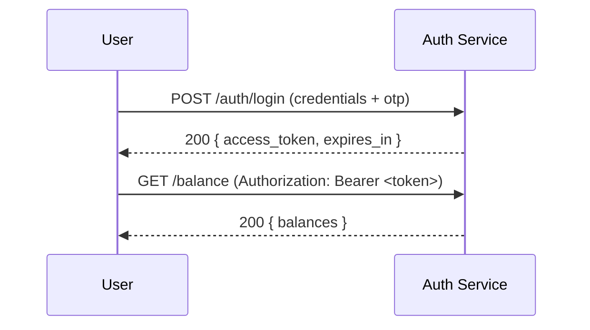
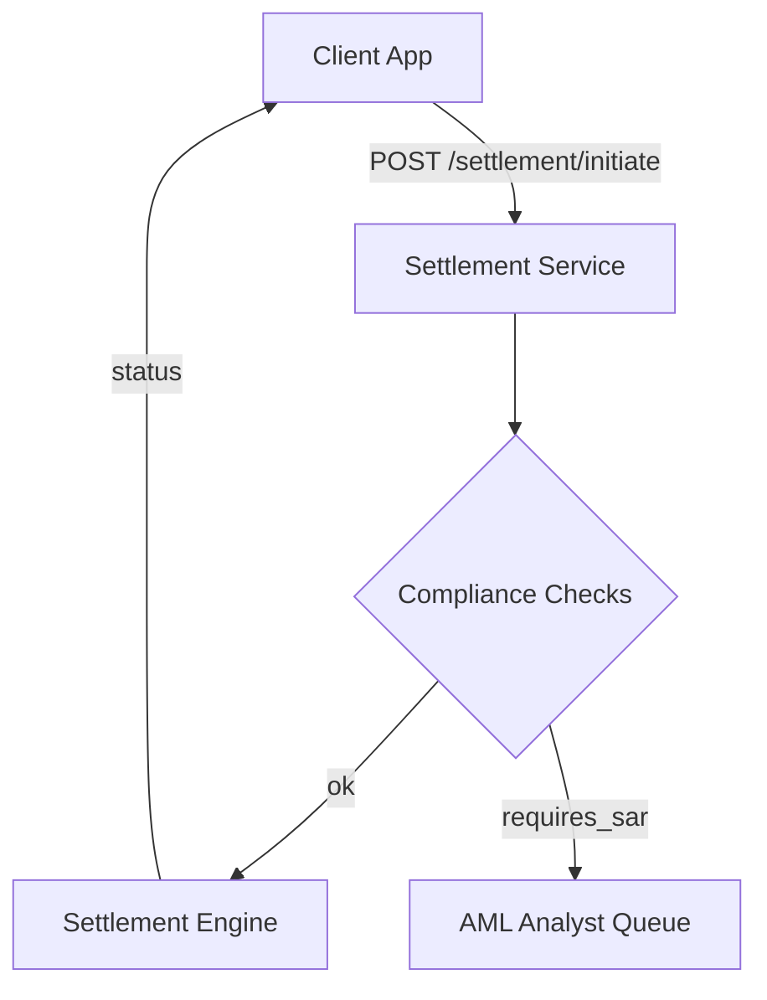

# API Guide — TEOS BankChain Mobile

⚠️ **Private Repository — Restricted to Partner Banks Only**
Access is limited to financial institutions operating under direct agreement with TEOS Egypt.
Redistribution or public disclosure is prohibited.

---

## 📌 Overview

This guide documents the **FastAPI backend endpoints**, **mobile client flows**, **compliance mapping**, and developer artifacts (OpenAPI, Postman collection, ISO 20022 examples) for TEOS BankChain Mobile.
All requests must be authenticated and comply with TEOS Egypt’s compliance framework (KYC/AML, audit trails, regulator reporting).

---

## 🔑 Authentication

### Endpoint

`POST /auth/login`

### Request

```json
{
  "username": "bankuser1",
  "password": "securePassword123",
  "otp": "123456"
}
```

### Response

```json
{
  "access_token": "eyJhbGciOiJIUzI1NiIs...",
  "token_type": "bearer",
  "expires_in": 3600
}
```

---

## 🏦 Accounts

### Endpoint

`POST /accounts/create`

### Request

```json
{
  "customer_id": "CUST12345",
  "fiat_currency": "EGP",
  "crypto_currency": "USDT"
}
```

### Response

```json
{
  "account_id": "ACC98765",
  "status": "active",
  "created_at": "2025-11-30T21:30:00Z"
}
```

---

## 💱 Conversion

### Endpoint

`POST /convert/execute`

### Request

```json
{
  "account_id": "ACC98765",
  "from_currency": "EGP",
  "to_currency": "USDT",
  "amount": 1000.00
}
```

### Response

```json
{
  "transaction_id": "TX123456",
  "status": "completed",
  "converted_amount": 19.50,
  "rate": 51.28,
  "timestamp": "2025-11-30T21:32:00Z"
}
```

---

## 📊 Balance

### Endpoint

`GET /balance?account_id=ACC98765`

### Response

```json
{
  "account_id": "ACC98765",
  "balances": {
    "EGP": 5000.00,
    "USDT": 250.00
  },
  "last_updated": "2025-11-30T21:35:00Z"
}
```

---

## 📜 Transactions

### Endpoint

`POST /transactions`

### Request

```json
{
  "account_id": "ACC98765",
  "type": "transfer",
  "to_account": "ACC54321",
  "amount": 100.00,
  "currency": "USDT"
}
```

### Response

```json
{
  "transaction_id": "TX654321",
  "status": "pending",
  "audit_log_id": "AUD12345",
  "timestamp": "2025-11-30T21:36:00Z"
}
```

---

## 📈 Rates

### Endpoint

`GET /rates?from=EGP&to=USDT`

### Response

```json
{
  "from_currency": "EGP",
  "to_currency": "USDT",
  "rate": 51.28,
  "timestamp": "2025-11-30T21:37:00Z"
}
```

---

## 📱 Mobile Client Flows (Expo / React Native)

* **Login Screen** → Calls `/auth/login` with OTP + biometrics.
* **Dashboard Screen** → Fetches `/balance` and `/transactions`.
* **Transfer Screen** → Executes `/transactions` with QR‑based account IDs.
* **Conversion Screen** → Calls `/convert/execute` with fiat ↔ crypto.
* **Compliance Alerts** → Push notifications triggered by backend monitoring.

---

## 🔒 Compliance Layer (Summary)

* All endpoints log immutable audit trails.
* KYC/AML checks enforced at account creation and transaction execution.
* Regulator reporting stubs available for CBE, SAMA, FCA, FATF.

---

# 📎 Developer Artifacts — Included in this file

1. Mermaid diagrams (sequence + flow)
2. Full OpenAPI (YAML) — ready for Swagger / Redoc import
3. Postman collection (v2.1 JSON) — includes compliance endpoints
4. ISO 20022 / XML examples for settlement & reporting

---

## 🔁 Diagrams (Mermaid)

### Authentication Flow



### Settlement Flow



---

## 🧾 OpenAPI — Full (YAML) (Import this into Swagger / Redoc)

```yaml
openapi: 3.0.1
info:
  title: TEOS BankChain Mobile API
  version: '1.0.0'
  description: |
    API for TEOS BankChain Mobile — partner banks only. Includes compliance endpoints.
servers:
  - url: https://sandbox.teos-bankchain.com/api/v1
    description: Sandbox
  - url: https://api.teos-bankchain.com/v1
    description: Production
components:
  securitySchemes:
    bearerAuth:
      type: http
      scheme: bearer
      bearerFormat: JWT
  schemas:
    LoginRequest:
      type: object
      required: [username, password]
      properties:
        username:
          type: string
        password:
          type: string
        otp:
          type: string
    TokenResponse:
      type: object
      properties:
        access_token:
          type: string
        token_type:
          type: string
        expires_in:
          type: integer
    AccountCreateRequest:
      type: object
      required: [customer_id, fiat_currency]
      properties:
        customer_id:
          type: string
        fiat_currency:
          type: string
        crypto_currency:
          type: string
    AccountResponse:
      type: object
      properties:
        account_id:
          type: string
        status:
          type: string
        created_at:
          type: string
          format: date-time
    ConvertRequest:
      type: object
      required: [account_id, from_currency, to_currency, amount]
      properties:
        account_id:
          type: string
        from_currency:
          type: string
        to_currency:
          type: string
        amount:
          type: number
          format: double
    ConvertResponse:
      type: object
      properties:
        transaction_id:
          type: string
        status:
          type: string
        converted_amount:
          type: number
        rate:
          type: number
        timestamp:
          type: string
          format: date-time
    TransactionRequest:
      type: object
      required: [account_id, type, amount, currency]
      properties:
        account_id:
          type: string
        type:
          type: string
          enum: [transfer, payout, deposit]
        to_account:
          type: string
        amount:
          type: number
        currency:
          type: string
    TransactionResponse:
      type: object
      properties:
        transaction_id:
          type: string
        status:
          type: string
        audit_log_id:
          type: string
        timestamp:
          type: string
          format: date-time
    AuditRecord:
      type: object
      properties:
        audit_id:
          type: string
        timestamp_utc:
          type: string
          format: date-time
        service:
          type: string
        operation:
          type: string
        initiator:
          type: object
        request:
          type: object
        response:
          type: object
        compliance_flags:
          type: object
        retention_class:
          type: string
        signature:
          type: string
    KYCRequest:
      type: object
      properties:
        customer_id:
          type: string
        full_name:
          type: string
        dob:
          type: string
          format: date
        id_type:
          type: string
        id_number:
          type: string
        address:
          type: string
    SARRequest:
      type: object
      properties:
        sar_id:
          type: string
        reported_at:
          type: string
          format: date-time
        subject:
          type: object
        transactions:
          type: array
          items:
            type: object
        reason:
          type: string
        analyst_notes:
          type: string
paths:
  /auth/login:
    post:
      summary: User login
      requestBody:
        required: true
        content:
          application/json:
            schema:
              $ref: '#/components/schemas/LoginRequest'
      responses:
        '200':
          description: Successful authentication
          content:
            application/json:
              schema:
                $ref: '#/components/schemas/TokenResponse'
  /accounts/create:
    post:
      summary: Create bank-linked account
      security:
        - bearerAuth: []
      requestBody:
        required: true
        content:
          application/json:
            schema:
              $ref: '#/components/schemas/AccountCreateRequest'
      responses:
        '201':
          description: Account created
          content:
            application/json:
              schema:
                $ref: '#/components/schemas/AccountResponse'
  /convert/execute:
    post:
      summary: Execute currency conversion
      security:
        - bearerAuth: []
      requestBody:
        required: true
        content:
          application/json:
            schema:
              $ref: '#/components/schemas/ConvertRequest'
      responses:
        '200':
          description: Conversion result
          content:
            application/json:
              schema:
                $ref: '#/components/schemas/ConvertResponse'
  /balance:
    get:
      summary: Get account balances
      security:
        - bearerAuth: []
      parameters:
        - name: account_id
          in: query
          schema:
            type: string
          required: true
      responses:
        '200':
          description: Balances
          content:
            application/json:
              schema:
                type: object
  /transactions:
    post:
      summary: Create transaction
      security:
        - bearerAuth: []
      requestBody:
        required: true
        content:
          application/json:
            schema:
              $ref: '#/components/schemas/TransactionRequest'
      responses:
        '202':
          description: Transaction accepted
          content:
            application/json:
              schema:
                $ref: '#/components/schemas/TransactionResponse'

  # Compliance endpoints
  /compliance/kyc:
    post:
      summary: Submit KYC data
      security:
        - bearerAuth: []
      requestBody:
        content:
          application/json:
            schema:
              $ref: '#/components/schemas/KYCRequest'
      responses:
        '201':
          description: KYC submitted
  /compliance/aml-check:
    post:
      summary: Run AML check
      security:
        - bearerAuth: []
      requestBody:
        content:
          application/json:
            schema:
              type: object
      responses:
        '200':
          description: AML result
  /compliance/sar:
    post:
      summary: Create SAR (internal)
      security:
        - bearerAuth: []
      requestBody:
        required: true
        content:
          application/json:
            schema:
              $ref: '#/components/schemas/SARRequest'
      responses:
        '201':
          description: SAR created
  /compliance/export:
    get:
      summary: Export audit/compliance data
      security:
        - bearerAuth: []
      parameters:
        - name: from
          in: query
          schema:
            type: string
            format: date
        - name: to
          in: query
          schema:
            type: string
            format: date
        - name: format
          in: query
          schema:
            type: string
            enum: [json, csv, xml]
      responses:
        '200':
          description: Encrypted export stream

security:
  - bearerAuth: []
```

---

## 🧾 Postman Collection (v2.1) — JSON

> Save the block below to `TEOS_BankChain_Postman_Collection.json` and import into Postman.

```json
{
  "info": {
    "_postman_id": "teos-bankchain-collection",
    "name": "TEOS BankChain API",
    "schema": "https://schema.getpostman.com/json/collection/v2.1.0/collection.json"
  },
  "item": [
    {
      "name": "Auth - Login",
      "request": {
        "method": "POST",
        "header": [{"key": "Content-Type", "value": "application/json"}],
        "body": {
          "mode": "raw",
          "raw": "{\n  \"username\": \"bankuser1\",\n  \"password\": \"securePassword123\",\n  \"otp\": \"123456\"\n}"
        },
        "url": {"raw": "{{baseUrl}}/auth/login", "host": ["{{baseUrl}}"], "path": ["auth","login"]}
      },
      "response": []
    },
    {
      "name": "Accounts - Create",
      "request": {
        "method": "POST",
        "header": [
          {"key": "Content-Type", "value": "application/json"},
          {"key": "Authorization", "value": "Bearer {{access_token}}"}
        ],
        "body": {
          "mode": "raw",
          "raw": "{\n  \"customer_id\": \"CUST12345\",\n  \"fiat_currency\": \"EGP\",\n  \"crypto_currency\": \"USDT\"\n}"
        },
        "url": {"raw": "{{baseUrl}}/accounts/create", "host": ["{{baseUrl}}"], "path": ["accounts","create"]}
      },
      "response": []
    },
    {
      "name": "Compliance - KYC",
      "request": {
        "method": "POST",
        "header": [
          {"key": "Content-Type", "value": "application/json"},
          {"key": "Authorization", "value": "Bearer {{access_token}}"}
        ],
        "body": {
          "mode": "raw",
          "raw": "{\n  \"customer_id\": \"CUST12345\",\n  \"full_name\": \"Jane Doe\",\n  \"dob\": \"1990-01-01\",\n  \"id_type\": \"national_id\",\n  \"id_number\": \"ID123456\",\n  \"address\": \"Cairo, Egypt\"\n}"
        },
        "url": {"raw": "{{baseUrl}}/compliance/kyc", "host": ["{{baseUrl}}"], "path": ["compliance","kyc"]}
      },
      "response": []
    },
    {
      "name": "Compliance - SAR",
      "request": {
        "method": "POST",
        "header": [
          {"key": "Content-Type", "value": "application/json"},
          {"key": "Authorization", "value": "Bearer {{access_token}}"}
        ],
        "body": {
          "mode": "raw",
          "raw": "{\n  \"sar_id\": \"SAR-20251130-0001\",\n  \"reported_at\": \"2025-11-30T21:45:00Z\",\n  \"subject\": {\n    \"customer_id\": \"CUST12345\"\n  },\n  \"transactions\": [\n    {\n      \"transaction_id\": \"TX123456\",\n      \"timestamp\": \"2025-11-30T21:36:00Z\",\n      \"amount\": 10000,\n      \"currency\": \"USD\"\n    }\n  ],\n  \"reason\": \"Structuring to avoid thresholds\",\n  \"analyst_notes\": \"Rapid deposits then withdrawals\"\n}"
        },
        "url": {"raw": "{{baseUrl}}/compliance/sar", "host": ["{{baseUrl}}"], "path": ["compliance","sar"]}
      },
      "response": []
    },
    {
      "name": "Compliance - Export",
      "request": {
        "method": "GET",
        "header": [
          {"key": "Authorization", "value": "Bearer {{access_token}}"}
        ],
        "url": {"raw": "{{baseUrl}}/compliance/export?from=2025-11-01&to=2025-11-30&format=json", "host": ["{{baseUrl}}"], "path": ["compliance","export"], "query": [{"key":"from","value":"2025-11-01"},{"key":"to","value":"2025-11-30"},{"key":"format","value":"json"}]}
      },
      "response": []
    }
  ],
  "variable": [
    {"key": "baseUrl", "value": "https://sandbox.teos-bankchain.com/api/v1"},
    {"key": "access_token", "value": ""}
  ]
}
```

---

## 🏦 ISO 20022 / XML Examples (Settlement & Reporting)

### Sample ISO 20022 pacs.008 (Customer Credit Transfer) — simplified example

```xml
<?xml version="1.0" encoding="UTF-8"?>
<Document xmlns="urn:iso:std:iso:20022:tech:xsd:pacs.008.001.02">
  <CstmrCdtTrfInitn>
    <GrpHdr>
      <MsgId>MSG20251130-0001</MsgId>
      <CreDtTm>2025-11-30T21:50:00Z</CreDtTm>
      <NbOfTxs>1</NbOfTxs>
      <CtrlSum>1000.00</CtrlSum>
      <InitgPty>
        <Nm>TEOS Egypt</Nm>
      </InitgPty>
    </GrpHdr>
    <PmtInf>
      <PmtInfId>PMTINF-0001</PmtInfId>
      <PmtMtd>TRF</PmtMtd>
      <BtchBookg>false</BtchBookg>
      <NbOfTxs>1</NbOfTxs>
      <CtrlSum>1000.00</CtrlSum>
      <PmtTpInf>
        <SvcLvl>
          <Cd>SEPA</Cd>
        </SvcLvl>
      </PmtTpInf>
      <ReqdExctnDt>2025-11-30</ReqdExctnDt>
      <Dbtr>
        <Nm>Customer A</Nm>
      </Dbtr>
      <DbtrAcct>
        <Id>
          <IBAN>EG4200000000000000000000</IBAN>
        </Id>
      </DbtrAcct>
      <CdtTrfTxInf>
        <PmtId>
          <InstrId>TX123456</InstrId>
          <EndToEndId>E2E-123</EndToEndId>
        </PmtId>
        <Amt>
          <InstdAmt Ccy="USD">1000.00</InstdAmt>
        </Amt>
        <Cdtr>
          <Nm>Beneficiary B</Nm>
        </Cdtr>
        <CdtrAcct>
          <Id>
            <IBAN>EG4300000000000000000001</IBAN>
          </Id>
        </CdtrAcct>
      </CdtTrfTxInf>
    </PmtInf>
  </CstmrCdtTrfInitn>
</Document>
```

> Note: For regulator submission, map fields to the precise ISO 20022 variant your counterparty/regulator requires (e.g., pacs.008 v.03 with full schema validation). We provide simplified examples here for developer testing.

---

## 📦 Delivery & Files

* **OpenAPI YAML**: included above — copy the `---` YAML block into `openapi.yaml` and import into Swagger or Redoc.
* **Postman**: copy the Postman JSON block into `TEOS_BankChain_Postman_Collection.json` and import into Postman.
* **ISO 20022**: save the XML snippet as `pacs.008.sample.xml` for testing.

---

## 📞 Contact

For dev/support and secure artifact delivery:
**TEOS Egypt Technical Team**
📧 private partner channel
📱 WhatsApp: +20 100 616 7293

---

## 🔁 Change Log

* `2025-11-30` — Full API guide + OpenAPI YAML + Postman collection + ISO 20022 examples added.

---
